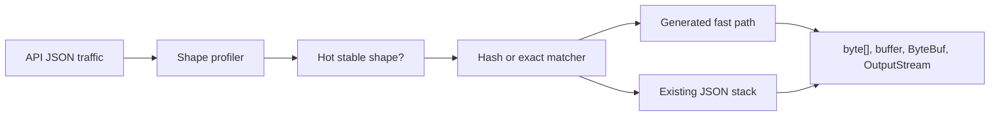

# json-fastlane

[English](README.md) · [설계](docs/DESIGN.ko.md) · [성능](docs/PERFORMANCE.ko.md) · [로드맵](docs/ROADMAP.ko.md) · [라이선스](LICENSE)

`json-fastlane`은 JVM 서버를 위한 **profile-guided JSON fast path** 실험
라이브러리입니다.

실제 API JSON을 관찰하고, 안정적인 hot payload shape를 찾은 뒤, 선택된 DTO만
generated low-allocation reader, writer, transport sink로 보냅니다. Jackson,
Spring, 또는 기존 JSON stack은 compatibility fallback으로 유지합니다.

## 왜 필요한가요?

범용 JSON 라이브러리는 넓은 호환성을 위해 설계되어 있습니다. 기본값으로는 그게
맞습니다.

다만 production API 중에는 같은 DTO shape가 반복적으로 오가는 hot path가 많습니다.
`json-fastlane`은 그 좁은 영역을 이렇게 최적화합니다.

1. endpoint별 실제 JSON shape를 관찰합니다.
2. shape가 충분히 안정적인지 확인합니다.
3. 그 shape만 generated code로 routing합니다.
4. shape가 달라지면 기존 JSON stack으로 fallback합니다.

fast path는 최적화입니다. generated codec이 안전하게 처리할 수 있음을 증명하기
전까지 correctness는 fallback의 책임입니다.

## 무엇을 하나요?

- raw UTF-8 byte에서 endpoint JSON shape를 profile합니다.
- field order, value kind, payload size, sample count, dropped shape를 추적합니다.
- JSON sample 또는 코드로 expected JSON shape를 등록합니다.
- hot-path routing용 exact shape matcher를 compile합니다.
- checkpointed early rejection을 가진 128-bit key/depth/value-kind fingerprint를 계산합니다.
- `@JsonFastlaneGenerateWriter`로 Java record writer를 생성합니다.
- `JsonSink`를 통해 `Utf8JsonBuffer`, Netty `ByteBuf`, `OutputStream`으로 씁니다.
- Spring MVC, Netty adapter prototype을 제공합니다.
- text report, metrics sink event, JFR snapshot을 제공합니다.

## 현재 상태

지금 구현된 것:

| 영역 | 상태 |
| --- | --- |
| Shape profiler | byte scanner, bounded endpoint/order tracking, compact field-order storage. |
| Shape guard | exact matcher, fingerprint matcher, checkpointed early rejection. |
| Writer generation | expected-shape metadata를 가진 Java record writer processor. |
| Transport lane | UTF-8, Netty, `OutputStream`용 `JsonSink` target. |
| Spring/Netty adapter | prototype converter와 writer registry. |
| Validation | smoke check, realistic load simulation, JMH scaffold, JFR task. |

아직 실험 단계인 것:

| 영역 | 한계 |
| --- | --- |
| ObjectMapper replacement | 아직 아닙니다. 선택된 hot DTO path를 대체하고 fallback을 유지합니다. |
| Reader generation | contract와 prototype은 있고, processor-generated reader는 future work입니다. |
| Jackson feature parity | naming strategy, custom serializer, polymorphism, date/time policy, annotation 전체 동작은 fallback 영역입니다. |
| Network stack | transport sink는 실행 가능하지만 완전한 end-to-end zero-copy runtime은 아닙니다. |

## 동작 방식



## 빠른 시작

로컬 검증 실행:

```bash
./gradlew check
./gradlew realisticLoadTest
./gradlew jmh -PjmhWarmups=1 -PjmhIterations=1 -PjmhForks=1
```

shape 기록:

```java
JsonFastlane fastlane = new JsonFastlane();

fastlane.record("/orders", "{\"userId\":1,\"items\":[],\"couponCode\":null}");
fastlane.record("/orders", "{\"userId\":2,\"items\":[],\"couponCode\":\"HELLO\"}");

for (EndpointProfileSnapshot snapshot : fastlane.snapshots()) {
    System.out.println(snapshot.endpoint());
    System.out.println(snapshot.fieldOrders());
}
```

알고 있는 shape 등록:

```java
fastlane.registerExpectedShape("/orders", ExpectedJsonShape.object(
    ExpectedJsonField.field("userId", JsonValueKind.NUMBER),
    ExpectedJsonField.field("items", JsonValueKind.ARRAY),
    ExpectedJsonField.field("couponCode", JsonValueKind.NULL)
));
```

stable payload routing:

```java
JsonShapeMatcher matcher = ExpectedJsonShape.object(
    ExpectedJsonField.field("userId", JsonValueKind.NUMBER),
    ExpectedJsonField.field("items", JsonValueKind.ARRAY),
    ExpectedJsonField.field("couponCode", JsonValueKind.NULL)
).compileMatcher();

if (matcher.matches(bodyBytes)) {
    // generated fast path
} else {
    // existing JSON stack
}
```

Java record writer 생성:

```java
@JsonFastlaneGenerateWriter
public record Invoice(long id, String email, List<InvoiceLine> lines) {
}

JsonFastlaneGeneratedWriter<Invoice> writer = new InvoiceJsonFastlaneWriter();

writer.write(invoice, utf8Buffer);
writer.write(invoice, new Utf8JsonSink(utf8Buffer));
writer.write(invoice, new NettyJsonSink(byteBuf));
writer.write(invoice, new OutputStreamJsonSink(outputStream));
```

## 모듈

| 모듈 | 역할 |
| --- | --- |
| `json-fastlane-core` | profiler, shape matcher, fingerprint, codec contract, report, UTF-8 buffer, transport sink. |
| `json-fastlane-processor` | Java record writer annotation processor. |
| `json-fastlane-spring` | Spring MVC profiling converter와 generated-writer converter. |
| `json-fastlane-netty` | Netty `ByteBuf` writer registry, buffer, sink. |
| `json-fastlane-benchmarks` | smoke check, realistic load simulation, JMH, JFR task. |

## 성능 요약

같은 payload를 기준으로 한 짧은 local run 결과입니다.

| 경로 | 결과 |
| --- | ---: |
| Generated reader vs Jackson read | 3.44x, 888 B/op |
| Generated writer vs Jackson write | 1.88x, 3,872 B/op |
| Reused buffer writer vs Jackson write | 2.10x, 48 B/op |
| Transport Netty sink vs Jackson write | 1.37x, 80 B/op |
| Spring transport converter vs Spring default write | 1.85x, 1,408 B/op |

이 숫자는 local health-check 결과이지 모든 환경에 대한 보장이 아닙니다. 역할별
scenario 표, baseline 구분, JMH 결과, 해석은 [성능 검증](docs/PERFORMANCE.ko.md)에
정리되어 있습니다.

## 문서

| 문서 | 내용 |
| --- | --- |
| [설계 노트](docs/DESIGN.ko.md) | architecture, fallback rule, shape hashing, transport lane 경계. |
| [성능 검증](docs/PERFORMANCE.ko.md) | 역할별 scenario 비교와 benchmark 해석. |
| [로드맵](docs/ROADMAP.ko.md) | 완료된 작업, 실험 단계, 다음 deep work. |

English docs are available as [Design Notes](docs/DESIGN.md),
[Performance Validation](docs/PERFORMANCE.md), and [Roadmap](docs/ROADMAP.md).

## 기술 메모

- Java 17 bytecode.
- Apache License 2.0.
- `json-fastlane-core`는 Spring, Jackson, Netty에 의존하지 않습니다.
- Spring, Netty adapter는 별도 모듈에 있습니다.
- profiler path는 monitor lock과 thread-local endpoint scope를 피합니다.
- endpoint 수, retained order, field scan width, nesting depth는 option으로 제한합니다.

## License

`json-fastlane`은 [Apache License 2.0](LICENSE)을 따릅니다.
