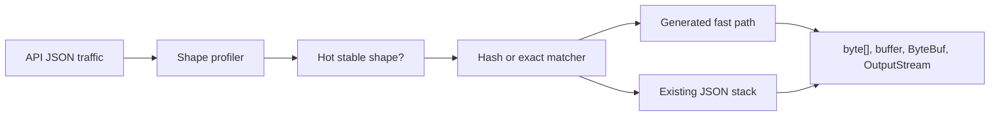

# json-fastlane

[한국어](README.ko.md) · [Design](docs/DESIGN.md) · [Performance](docs/PERFORMANCE.md) · [Roadmap](docs/ROADMAP.md) · [License](LICENSE)

`json-fastlane` is an experimental JVM library for **profile-guided JSON fast
paths**.

It watches real API JSON, finds stable hot payload shapes, and lets selected
DTOs move to generated low-allocation readers, writers, and transport sinks.
Jackson, Spring, or your existing JSON stack stays as the compatibility
fallback.

## Why

General-purpose JSON libraries are designed for broad compatibility. That is
the right default.

But many production APIs repeatedly send the same stable DTO shapes. For those
hot paths, `json-fastlane` explores a narrower idea:

1. observe real JSON shape per endpoint
2. prove the shape is stable enough
3. route only that shape to generated code
4. fall back when the shape drifts

The fast path is an optimization. Correctness still belongs to the fallback
until a generated codec covers the case safely.

## What It Does

- Profiles endpoint JSON shape from raw UTF-8 bytes.
- Tracks field order, value kind, payload size, sample count, and dropped shapes.
- Ranks fast-path candidates by sample count, hot field-order stability, payload size, and drift risk.
- Registers expected JSON shapes from samples or code.
- Compiles exact shape matchers for hot-path routing.
- Computes 128-bit key/depth/value-kind fingerprints with checkpointed early rejection.
- Computes homogeneous-array skeleton fingerprints for variable-length list shapes.
- Generates Java record writers with `@JsonFastlaneGenerateWriter`.
- Writes to `Utf8JsonBuffer`, Netty `ByteBuf`, or `OutputStream` through `JsonSink`.
- Provides Spring MVC and Netty adapter prototypes.
- Exports text reports, metrics sink events, and JFR snapshots.

## Status

Implemented today:

| Area | State |
| --- | --- |
| Shape profiler | Byte scanner, bounded endpoint/order tracking, compact field-order storage. |
| Candidate report | Fast-path candidate scoring and a sample Gradle report task. |
| Shape guards | Exact matcher, fingerprint matcher, checkpointed early rejection. |
| Skeleton fingerprint | Variable-length homogeneous arrays can share a shape fingerprint. |
| Writer generation | Java record writer processor with expected-shape metadata. |
| Transport lane | `JsonSink` targets for UTF-8, Netty, and `OutputStream`. |
| Spring/Netty adapters | Prototype converters and writer registries. |
| Validation | Smoke checks, realistic load simulation, JMH scaffold, JFR task. |

Still experimental:

| Area | Limit |
| --- | --- |
| ObjectMapper replacement | Not yet. The project replaces selected hot DTO paths and keeps fallback. |
| Reader generation | Contracts and prototypes exist; processor-generated readers are future work. |
| Jackson feature parity | Naming strategies, custom serializers, polymorphism, date/time policy, and full annotation behavior remain fallback territory. |
| Network stack | Transport sinks are executable, but not a complete end-to-end zero-copy runtime. |

## How It Works



## Quick Start

Run the local checks:

```bash
./gradlew check
./gradlew fastPathCandidateReport
./gradlew fastPathCandidateReport -PcandidateSamples=/path/to/samples.tsv
./gradlew fastPathCandidateReport -PcandidateSamples=/path/to/samples.tsv -PcandidateConfig=/path/to/candidate.properties
./gradlew fastPathCandidateReport -PcandidateSamples=/path/to/samples.tsv -PcandidateOutput=json
./gradlew compareFastPathCandidateReports -PbaselineReport=/path/to/baseline.json -PcurrentReport=/path/to/current.json
./gradlew realisticLoadTest
./gradlew jmh -PjmhWarmups=1 -PjmhIterations=1 -PjmhForks=1
```

Captured sample files can use one JSON payload per line:

```text
/orders	{"userId":1,"items":[]}
/orders	{"userId":2,"items":[]}
```

`candidateSamples` may also point at a directory of `.json` files. File paths are
converted to endpoint names, and numeric suffixes like `orders/create-1.json`
are grouped as `/orders/create`.

Optional candidate config uses Java `.properties` syntax:

```properties
endpoint./orders/=/orders/{id}
redactFields=email,token
```

`endpoint.<prefix>=<target>` groups captured endpoint names before scoring.
`redactFields` replaces matching top-level JSON field values with `null` before
profiling so sensitive scalar values do not affect captured reports.

Use `-PcandidateOutput=json` when the report is consumed by CI or another tool.
Use `compareFastPathCandidateReports` to fail CI when a current report has a
large score drop, hot-order stability drop, or dropped-order increase.

Record shapes:

```java
JsonFastlane fastlane = new JsonFastlane();

fastlane.record("/orders", "{\"userId\":1,\"items\":[],\"couponCode\":null}");
fastlane.record("/orders", "{\"userId\":2,\"items\":[],\"couponCode\":\"HELLO\"}");

for (EndpointProfileSnapshot snapshot : fastlane.snapshots()) {
    System.out.println(snapshot.endpoint());
    System.out.println(snapshot.fieldOrders());
}

for (JsonFastlaneCandidate candidate : JsonFastlaneReport.candidates(fastlane.snapshots())) {
    System.out.println(candidate.endpoint() + " " + candidate.recommendation());
}
```

Register a known shape:

```java
fastlane.registerExpectedShape("/orders", ExpectedJsonShape.object(
    ExpectedJsonField.field("userId", JsonValueKind.NUMBER),
    ExpectedJsonField.field("items", JsonValueKind.ARRAY),
    ExpectedJsonField.field("couponCode", JsonValueKind.NULL)
));
```

Route a stable payload:

```java
JsonShapeMatcher matcher = ExpectedJsonShape.object(
    ExpectedJsonField.field("userId", JsonValueKind.NUMBER),
    ExpectedJsonField.field("items", JsonValueKind.ARRAY),
    ExpectedJsonField.field("couponCode", JsonValueKind.NULL)
).compileMatcher();

if (matcher.matches(bodyBytes)) {
    // generated fast path
} else {
    // existing JSON stack
}
```

Generate a writer for a Java record:

```java
@JsonFastlaneGenerateWriter
public record Invoice(long id, String email, List<InvoiceLine> lines) {
}

JsonFastlaneGeneratedWriter<Invoice> writer = new InvoiceJsonFastlaneWriter();

writer.write(invoice, utf8Buffer);
writer.write(invoice, new Utf8JsonSink(utf8Buffer));
writer.write(invoice, new NettyJsonSink(byteBuf));
writer.write(invoice, new OutputStreamJsonSink(outputStream));
```

## Modules

| Module | Purpose |
| --- | --- |
| `json-fastlane-core` | Profiler, shape matchers, fingerprints, codec contracts, reports, UTF-8 buffer, transport sinks. |
| `json-fastlane-processor` | Annotation processor for Java record writers. |
| `json-fastlane-spring` | Spring MVC profiling and generated-writer converters. |
| `json-fastlane-netty` | Netty `ByteBuf` writer registry, buffer, and sink. |
| `json-fastlane-benchmarks` | Smoke checks, realistic load simulation, JMH, and JFR tasks. |

## Performance Snapshot

Short local run, same payloads, relative to the comparable baseline:

| Path | Result |
| --- | ---: |
| Generated reader vs Jackson read | 3.44x, 888 B/op |
| Generated writer vs Jackson write | 1.88x, 3,872 B/op |
| Reused buffer writer vs Jackson write | 2.10x, 48 B/op |
| Transport Netty sink vs Jackson write | 1.37x, 80 B/op |
| Spring transport converter vs Spring default write | 1.85x, 1,408 B/op |

These are local health-check numbers, not universal claims. See
[Performance Validation](docs/PERFORMANCE.md) for role-by-role scenario tables,
baseline labels, JMH output, and interpretation.

## Documentation

| Document | What to read there |
| --- | --- |
| [Design Notes](docs/DESIGN.md) | Architecture, fallback rules, shape hashing, transport lane boundaries. |
| [Performance Validation](docs/PERFORMANCE.md) | Scenario-by-scenario comparisons and benchmark interpretation. |
| [Roadmap](docs/ROADMAP.md) | Completed work, experimental areas, and next deep tasks. |

Korean docs are available as [설계 노트](docs/DESIGN.ko.md),
[성능 검증](docs/PERFORMANCE.ko.md), and [로드맵](docs/ROADMAP.ko.md).

## Technical Notes

- Java 17 bytecode.
- Apache License 2.0.
- `json-fastlane-core` has no Spring, Jackson, or Netty dependency.
- Spring and Netty adapters live in separate modules.
- Profiler paths avoid monitor locks and thread-local endpoint scope.
- Endpoint count, retained orders, field scan width, and nesting depth are bounded by options.

## License

`json-fastlane` is licensed under the [Apache License 2.0](LICENSE).
