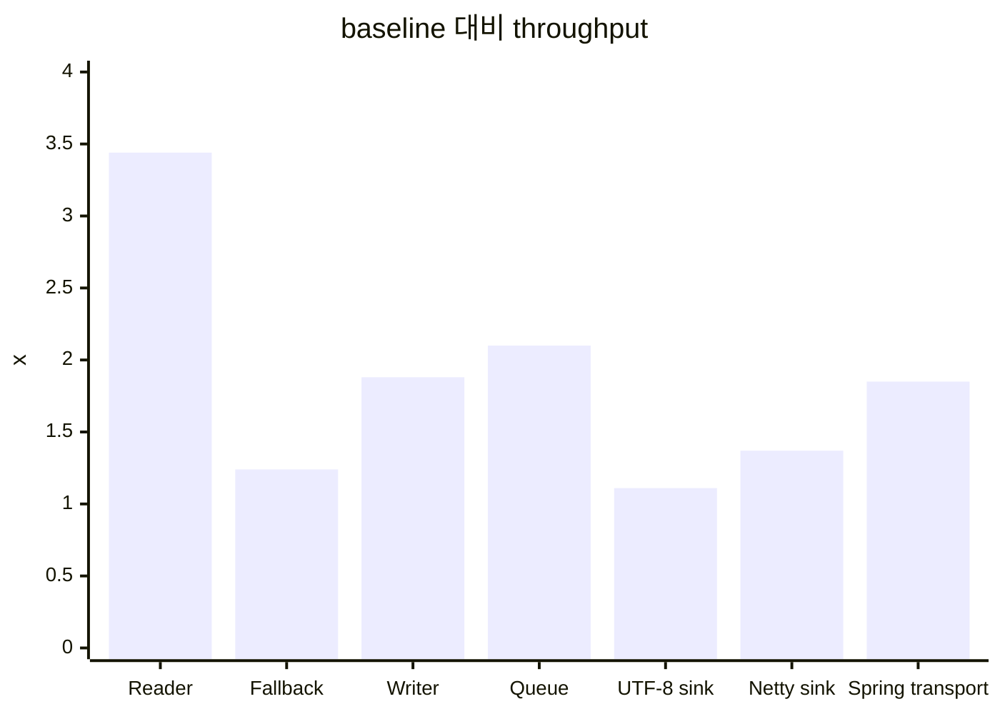

# 성능 검증

[English](PERFORMANCE.md)

첫 번째 반복 가능한 성능 검증은 `realisticLoadTest`입니다.

```bash
./gradlew realisticLoadTest
```

기본 모델:

- worker thread 8개
- scenario별 worker당 12,000 iterations
- 479 byte checkout request
- 1,764 byte order summary response
- returned object와 byte가 실제로 사용되도록 blackhole consumption 적용
- lower-allocation response path 추정을 위한 queue-reused buffer writer scenario
- 등록된 writer를 쓰는 `HttpMessageConverter` path 측정을 위한 Spring direct writer scenario
- UTF-8, Netty, direct Spring `OutputStream` sink를 위한 transport scenario

실행 조건 조정:

```bash
./gradlew realisticLoadTest -PloadThreads=16 -PloadIterations=50000
```

JFR profile 캡처:

```bash
./gradlew jfrRealisticLoadTest
```

recording은 다음 위치에 생성됩니다.

```text
build/reports/json-fastlane/realistic-load.jfr
```

JMH 실행:

```bash
./gradlew jmh
./gradlew jmh -PjmhInclude=io.jsonfastlane.bench.JsonFastPathBenchmark.fastlaneWriteNettyByteBuf
```

실행 가능한 성능 task는 모두 `json-fastlane-benchmarks` 모듈에 있지만, Gradle root에서
task 이름으로 실행할 수 있습니다.

## 역할별 구현체 비교

`출처`는 이 숫자가 우리 오픈소스 구현의 결과인지, 비교를 위한 외부 baseline인지
구분합니다.

### Request Read

| 구현체 | Scenario | 출처 | ops/s | alloc/op | 설명 |
| --- | --- | --- | ---: | ---: | --- |
| Jackson databind | `jackson-read-checkout` | 외부 baseline | 190,798 | 2,466 B | plain Jackson `ObjectMapper`가 checkout request를 DTO로 읽는 기준선입니다. |
| Spring default converter | `spring-default-read-checkout` | 외부 baseline | 269,469 | 3,531 B | Spring MVC의 기본 Jackson converter가 같은 request를 읽습니다. |
| Profiling converter | `profiling-converter-read-checkout` | json-fastlane instrumentation | 156,266 | 4,789 B | Jackson으로 읽으면서 timing과 JSON shape를 기록하므로 관찰 비용이 포함됩니다. |
| Generated-style reader | `fastlane-generated-read-checkout` | json-fastlane fast path | 656,898 | 888 B | stable field order를 가정하고 direct field check로 DTO를 만듭니다. |

### Fallback Read

| 구현체 | Scenario | 출처 | ops/s | alloc/op | 설명 |
| --- | --- | --- | ---: | ---: | --- |
| Exception fallback | `fastlane-fallback-read-shuffled` | json-fastlane fallback path | 379,064 | 3,288 B | field 순서가 섞인 valid JSON에서 strict reader가 exception으로 miss한 뒤 Jackson으로 fallback합니다. |
| Non-throwing fallback | `fastlane-aware-fallback-read-shuffled` | json-fastlane fallback path | 469,699 | 2,489 B | `TryFastJsonReader`가 `null` miss를 반환해서 정상 branch로 Jackson fallback을 탑니다. |

### Core Write

| 구현체 | Scenario | 출처 | ops/s | alloc/op | 설명 |
| --- | --- | --- | ---: | ---: | --- |
| Jackson databind | `jackson-write-summary` | 외부 baseline | 371,642 | 2,782 B | plain Jackson이 order summary response를 owned `byte[]`로 씁니다. |
| Generated `byte[]` writer | `fastlane-generated-write-summary` | json-fastlane fast path | 697,492 | 3,872 B | 우리 writer가 static field segment와 direct value write로 JSON을 만들고 `byte[]`를 반환합니다. |
| Reused buffer writer | `fastlane-reused-buffer-write-summary` | json-fastlane fast path | 779,723 | 48 B | caller-owned `Utf8JsonBuffer`를 재사용해서 final array ownership을 피합니다. |
| UTF-8 transport sink | `fastlane-transport-utf8-sink-summary` | json-fastlane transport lane | 413,154 | 64 B | 같은 `TransportJsonWriter`가 `Utf8JsonSink`를 target으로 씁니다. |
| Netty transport sink | `fastlane-transport-netty-sink-summary` | json-fastlane transport lane | 509,343 | 80 B | 같은 `TransportJsonWriter`가 pooled Netty `ByteBuf` target으로 씁니다. |

### Spring Write

| 구현체 | Scenario | 출처 | ops/s | alloc/op | 설명 |
| --- | --- | --- | ---: | ---: | --- |
| Spring default converter | `spring-default-write-summary` | 외부 baseline | 243,239 | 4,014 B | Spring MVC의 기본 Jackson converter가 response를 씁니다. |
| Profiling converter | `profiling-converter-write-summary` | json-fastlane instrumentation | 147,939 | 10,383 B | Jackson으로 쓰면서 profiling과 shape recording을 수행하는 관찰 경로입니다. |
| Spring direct writer | `fastlane-spring-direct-write-summary` | json-fastlane Spring adapter | 327,519 | 5,712 B | Jackson 기반 profiling converter 안에서 등록된 fast writer로 직접 routing합니다. |
| Spring direct sink output | `fastlane-spring-direct-sink-summary` | json-fastlane Spring adapter | 306,403 | 3,648 B | direct writer를 sink-style output message와 함께 검증한 경로입니다. |
| Dedicated fast converter | `fastlane-dedicated-sink-summary` | json-fastlane Spring adapter | 424,097 | 3,561 B | Jackson 상속 경로를 줄인 generated-only Spring converter입니다. |
| Spring transport converter | `fastlane-spring-transport-summary` | json-fastlane transport lane | 449,330 | 1,408 B | `OutputStreamJsonSink`로 streaming해서 중간 JSON buffer를 피합니다. |

## 최신 로컬 결과

이 workspace의 짧은 실행 결과:

```text
scenario                                      ops/s       p50 us       p95 us       p99 us     alloc/op
jackson-read-checkout                        190798         7.79        30.25        36.17       2466 B
spring-default-read-checkout                 269469         6.79         8.92        11.96       3531 B
profiling-converter-read-checkout            156266         9.04        20.42        28.58       4789 B
fastlane-generated-read-checkout             656898         2.96         3.83         4.75        888 B
fastlane-fallback-read-shuffled              379064         4.83         6.25         8.21       3288 B
fastlane-aware-fallback-read-shuffled        469699         3.46         6.96         8.92       2489 B
jackson-write-summary                        371642         4.58         8.46        11.33       2782 B
spring-default-write-summary                 243239         7.04        14.04        17.38       4014 B
profiling-converter-write-summary            147939        11.00        21.42        27.96      10383 B
fastlane-generated-write-summary             697492         2.42         4.92         6.83       3872 B
fastlane-reused-buffer-write-summary         779723         2.25         4.25         5.08         48 B
fastlane-transport-utf8-sink-summary         413154         4.67         7.17         7.67         64 B
fastlane-transport-netty-sink-summary        509343         3.04         7.42         8.33         80 B
fastlane-spring-direct-write-summary         327519         4.96        10.04        13.54       5712 B
fastlane-spring-direct-sink-summary          306403         5.58        10.46        14.04       3648 B
fastlane-dedicated-sink-summary              424097         3.42         7.92        10.92       3561 B
fastlane-spring-transport-summary            449330         3.21         7.54        10.96       1408 B
```

## 비교 요약

| 비교 | 결과 | 의미 |
| --- | ---: | --- |
| Generated reader vs Jackson read | throughput 3.44x, 888 B/op | stable request shape는 direct field check 이득이 있습니다. |
| Non-throwing fallback vs exception fallback | throughput 1.24x, 2489 B/op | 예상 가능한 shape drift는 exception이 아니라 branch여야 합니다. |
| Generated writer vs Jackson write | throughput 1.88x, 3872 B/op | static field segment와 direct value write가 이 DTO에서 databind보다 빠릅니다. |
| Queue-reused writer vs Jackson write | throughput 2.10x, 48 B/op | 서버에서는 최종 `byte[]` ownership을 피하는 효과가 여전히 큽니다. |
| Transport UTF-8 sink vs Jackson write | throughput 1.11x, 64 B/op | sink indirection은 allocation을 낮추지만 specialized reusable buffer보다는 느립니다. |
| Transport Netty sink vs Jackson write | throughput 1.37x, 80 B/op | 같은 transport writer가 pooled Netty output을 target으로 삼을 수 있습니다. |
| Spring transport converter vs Spring default write | throughput 1.85x, 1408 B/op | direct `OutputStreamJsonSink`가 중간 JSON buffer를 피합니다. |



## 짧은 JMH 결과

warmup 1회, measurement 1회 JMH 실행 결과:

| 구현체 | 출처 | ops/s | Jackson 대비 | 설명 |
| --- | --- | ---: | ---: | --- |
| Jackson `writeValueAsBytes` | 외부 baseline | 6,156,778 | 1.00x | Jackson이 작은 response를 쓰고 owned `byte[]`를 반환합니다. |
| Fastlane `byte[]` writer | json-fastlane fast path | 23,608,763 | 3.83x | 우리 UTF-8 writer가 owned `byte[]`를 반환합니다. |
| Fastlane reusable buffer | json-fastlane fast path | 24,294,379 | 3.95x | 우리 UTF-8 writer가 caller-owned buffer를 재사용합니다. |
| Fastlane UTF-8 `JsonSink` | json-fastlane transport lane | 21,727,679 | 3.53x | 우리 transport writer가 `Utf8JsonSink`를 target으로 씁니다. |
| Fastlane Netty `ByteBuf` | json-fastlane Netty path | 21,536,833 | 3.50x | 우리 Netty-specific buffer writer가 `ByteBuf`를 target으로 씁니다. |
| Fastlane Netty `JsonSink` | json-fastlane transport lane | 19,378,458 | 3.15x | 우리 transport writer가 `NettyJsonSink`를 target으로 씁니다. |

## 숫자 해석

- profiling converter는 plain Jackson보다 의도적으로 느립니다. body copy, timing 기록,
  JSON shape scan을 수행하기 때문입니다.
- queue-reused writer는 `writeValueAsBytes`와 완전히 같은 조건의 대체가 아닙니다.
  reusable response buffer 또는 stream에 쓰는 server path를 모델링합니다.
- transport lane은 이제 UTF-8, Netty, `OutputStream` sink smoke coverage와 load/JMH
  비교 scenario를 가집니다. 이번 실행에서는 raw throughput은 reusable buffer가
  더 강하고, transport sink는 target portability와 낮은 allocation이 장점입니다.
- 정확한 숫자는 머신과 실행마다 달라집니다. health signal로 보고, 중요한 판단에는
  JMH와 JFR을 함께 봐야 합니다.

## 이미 반영된 JVM 지향 최적화

- writer registry가 class-to-writer lookup을 cache하고 per-write `Optional` allocation을 피합니다.
- `Utf8JsonBuffer.writeString`에 ASCII no-escape fast path가 있습니다.
- control-character unicode escape를 `String.format` 없이 직접 씁니다.
- generated reader cursor가 static JSON fragment를 cursor 이동 전에 비교합니다.
- `FallbackAwareJsonReader`가 valid uncommon shape에서 exception-driven fallback을 피합니다.
- `NettyJsonBuffer`와 `FastJsonByteBufWriter`가 pooled-buffer path를 제공합니다.
- `@JsonFastlaneGenerateWriter`가 pre-encoded field prefix를 가진 Java record writer를 생성합니다.
- `JsonSink`가 generated writer를 UTF-8, Netty, `OutputStream` sink로 보낼 수 있게 합니다.
- generated writer가 field prefix를 `byte[]`와 segment로 이중 저장하지 않고
  field당 하나의 `JsonSegment` constant를 사용합니다.

## 완료된 검증

- realistic load simulation
- Spring default baseline 비교
- JFR-enabled load task
- generated reader fallback tracking
- annotation processor generated Java record writer
- scenario별 allocation reporting
- Netty `ByteBuf` writer scaffold
- transport lane smoke check
- transport lane load scenario
- JMH transport sink benchmark

## 다음 측정

1. large array 기준 pooled `ByteBuf` writer benchmark.
2. 실제 servlet container buffering을 포함한 `OutputStreamJsonSink` benchmark.
3. processor가 reader를 생성한 뒤 generated `TryFastJsonReader` benchmark.
4. stable payload와 drifting payload가 섞인 조건의 fallback-rate reporting.
