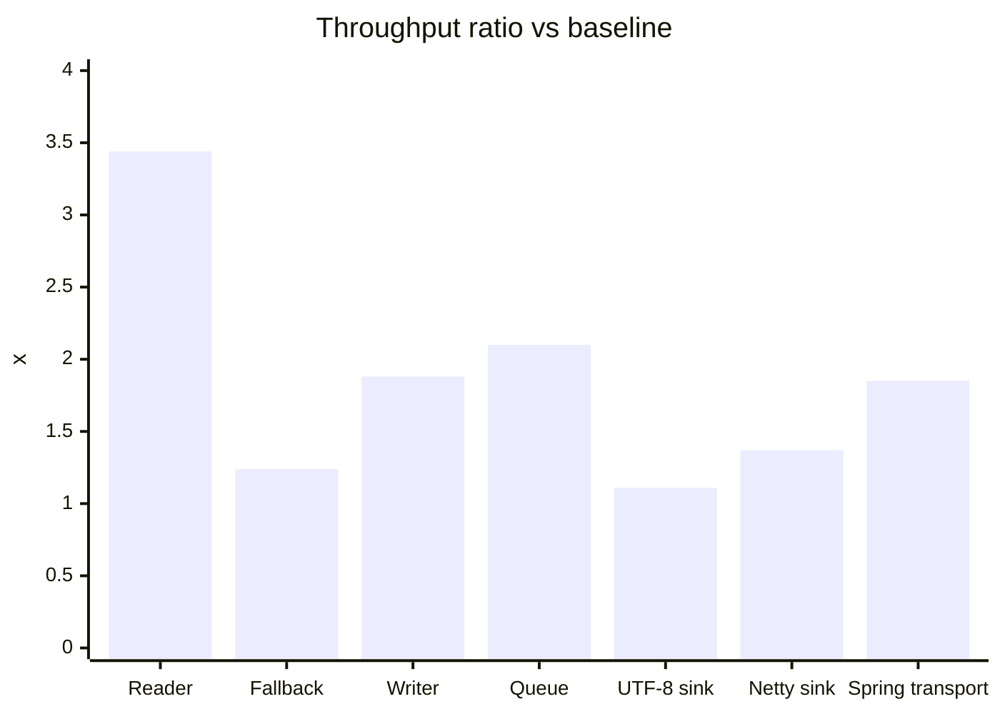

# Performance Validation

[한국어](PERFORMANCE.ko.md)

The first repeatable performance check is `realisticLoadTest`.

```bash
./gradlew realisticLoadTest
```

Default model:

- 8 worker threads
- 12,000 iterations per worker per scenario
- 479 byte checkout request
- 1,764 byte order summary response
- blackhole consumption so returned objects and bytes are used
- queue-reused buffer writer scenario to estimate a lower-allocation response path
- Spring direct writer scenario to measure the `HttpMessageConverter` path with a registered writer
- transport scenarios for UTF-8, Netty, and direct Spring `OutputStream` sinks

Tune the run:

```bash
./gradlew realisticLoadTest -PloadThreads=16 -PloadIterations=50000
```

Capture a JFR profile:

```bash
./gradlew jfrRealisticLoadTest
```

The recording is written to:

```text
build/reports/json-fastlane/realistic-load.jfr
```

Run JMH:

```bash
./gradlew jmh
./gradlew jmh -PjmhInclude=io.jsonfastlane.bench.JsonFastPathBenchmark.fastlaneWriteNettyByteBuf
```

All executable performance tasks live in `json-fastlane-benchmarks`, but Gradle
can run them from the root by task name.

## Role-Based Comparison

`Origin` explains whether the number is from this open-source project or from a
baseline library used for comparison.

### Request Read

| Implementation | Scenario | Origin | ops/s | alloc/op | Explanation |
| --- | --- | --- | ---: | ---: | --- |
| Jackson databind | `jackson-read-checkout` | External baseline | 190,798 | 2,466 B | Plain Jackson `ObjectMapper` reads the checkout request into a DTO. |
| Spring default converter | `spring-default-read-checkout` | External baseline | 269,469 | 3,531 B | Spring MVC's default Jackson converter reads the same request. |
| Profiling converter | `profiling-converter-read-checkout` | json-fastlane instrumentation | 156,266 | 4,789 B | Reads through Jackson while recording timing and JSON shape, so observation cost is included. |
| Generated-style reader | `fastlane-generated-read-checkout` | json-fastlane fast path | 656,898 | 888 B | Assumes stable field order and builds the DTO with direct field checks. |

### Fallback Read

| Implementation | Scenario | Origin | ops/s | alloc/op | Explanation |
| --- | --- | --- | ---: | ---: | --- |
| Exception fallback | `fastlane-fallback-read-shuffled` | json-fastlane fallback path | 379,064 | 3,288 B | A valid shuffled shape misses the strict reader through an exception, then falls back to Jackson. |
| Non-throwing fallback | `fastlane-aware-fallback-read-shuffled` | json-fastlane fallback path | 469,699 | 2,489 B | `TryFastJsonReader` returns a normal miss, then falls back to Jackson through a branch. |

### Core Write

| Implementation | Scenario | Origin | ops/s | alloc/op | Explanation |
| --- | --- | --- | ---: | ---: | --- |
| Jackson databind | `jackson-write-summary` | External baseline | 371,642 | 2,782 B | Plain Jackson writes the order summary response to an owned `byte[]`. |
| Generated `byte[]` writer | `fastlane-generated-write-summary` | json-fastlane fast path | 697,492 | 3,872 B | Our writer uses static field segments and direct value writes, then returns a `byte[]`. |
| Reused buffer writer | `fastlane-reused-buffer-write-summary` | json-fastlane fast path | 779,723 | 48 B | Reuses a caller-owned `Utf8JsonBuffer` and avoids final array ownership. |
| UTF-8 transport sink | `fastlane-transport-utf8-sink-summary` | json-fastlane transport lane | 413,154 | 64 B | The same `TransportJsonWriter` targets `Utf8JsonSink`. |
| Netty transport sink | `fastlane-transport-netty-sink-summary` | json-fastlane transport lane | 509,343 | 80 B | The same `TransportJsonWriter` targets pooled Netty `ByteBuf` output. |

### Spring Write

| Implementation | Scenario | Origin | ops/s | alloc/op | Explanation |
| --- | --- | --- | ---: | ---: | --- |
| Spring default converter | `spring-default-write-summary` | External baseline | 243,239 | 4,014 B | Spring MVC's default Jackson converter writes the response. |
| Profiling converter | `profiling-converter-write-summary` | json-fastlane instrumentation | 147,939 | 10,383 B | Writes through Jackson while recording conversion and shape data. |
| Spring direct writer | `fastlane-spring-direct-write-summary` | json-fastlane Spring adapter | 327,519 | 5,712 B | The Jackson-derived profiling converter routes a registered fast writer directly. |
| Spring direct sink output | `fastlane-spring-direct-sink-summary` | json-fastlane Spring adapter | 306,403 | 3,648 B | Validates direct writer output with a sink-style output message. |
| Dedicated fast converter | `fastlane-dedicated-sink-summary` | json-fastlane Spring adapter | 424,097 | 3,561 B | A thinner generated-only Spring converter reduces Jackson-inherited overhead. |
| Spring transport converter | `fastlane-spring-transport-summary` | json-fastlane transport lane | 449,330 | 1,408 B | Streams through `OutputStreamJsonSink` and avoids the intermediate JSON buffer. |

## Latest Local Result

Short run on this workspace:

```text
scenario                                      ops/s       p50 us       p95 us       p99 us     alloc/op
jackson-read-checkout                        190798         7.79        30.25        36.17       2466 B
spring-default-read-checkout                 269469         6.79         8.92        11.96       3531 B
profiling-converter-read-checkout            156266         9.04        20.42        28.58       4789 B
fastlane-generated-read-checkout             656898         2.96         3.83         4.75        888 B
fastlane-fallback-read-shuffled              379064         4.83         6.25         8.21       3288 B
fastlane-aware-fallback-read-shuffled        469699         3.46         6.96         8.92       2489 B
jackson-write-summary                        371642         4.58         8.46        11.33       2782 B
spring-default-write-summary                 243239         7.04        14.04        17.38       4014 B
profiling-converter-write-summary            147939        11.00        21.42        27.96      10383 B
fastlane-generated-write-summary             697492         2.42         4.92         6.83       3872 B
fastlane-reused-buffer-write-summary         779723         2.25         4.25         5.08         48 B
fastlane-transport-utf8-sink-summary         413154         4.67         7.17         7.67         64 B
fastlane-transport-netty-sink-summary        509343         3.04         7.42         8.33         80 B
fastlane-spring-direct-write-summary         327519         4.96        10.04        13.54       5712 B
fastlane-spring-direct-sink-summary          306403         5.58        10.46        14.04       3648 B
fastlane-dedicated-sink-summary              424097         3.42         7.92        10.92       3561 B
fastlane-spring-transport-summary            449330         3.21         7.54        10.96       1408 B
```

## Comparison Summary

| Comparison | Result | Meaning |
| --- | ---: | --- |
| Generated reader vs Jackson read | 3.44x throughput, 888 B/op | Stable request shape benefits from direct field checks. |
| Non-throwing fallback vs exception fallback | 1.24x throughput, 2489 B/op | Expected shape drift should be a branch, not an exception. |
| Generated writer vs Jackson write | 1.88x throughput, 3872 B/op | Static field segments and direct value writes beat databind on this DTO. |
| Queue-reused writer vs Jackson write | 2.10x throughput, 48 B/op | Avoiding final `byte[]` ownership is still the strongest server-side win. |
| Transport UTF-8 sink vs Jackson write | 1.11x throughput, 64 B/op | Sink indirection cuts allocation but is slower than the specialized reusable buffer. |
| Transport Netty sink vs Jackson write | 1.37x throughput, 80 B/op | The same transport writer can target pooled Netty output. |
| Spring transport converter vs Spring default write | 1.85x throughput, 1408 B/op | Direct `OutputStreamJsonSink` avoids the intermediate JSON buffer. |



## Short JMH Result

One-warmup, one-measurement JMH run:

| Implementation | Origin | ops/s | Ratio vs Jackson | Explanation |
| --- | --- | ---: | ---: | --- |
| Jackson `writeValueAsBytes` | External baseline | 6,156,778 | 1.00x | Jackson writes a small response and returns an owned `byte[]`. |
| Fastlane `byte[]` writer | json-fastlane fast path | 23,608,763 | 3.83x | Our UTF-8 writer returns an owned `byte[]`. |
| Fastlane reusable buffer | json-fastlane fast path | 24,294,379 | 3.95x | Our UTF-8 writer reuses the caller-owned buffer. |
| Fastlane UTF-8 `JsonSink` | json-fastlane transport lane | 21,727,679 | 3.53x | Our transport writer targets `Utf8JsonSink`. |
| Fastlane Netty `ByteBuf` | json-fastlane Netty path | 21,536,833 | 3.50x | Our Netty-specific buffer writer targets `ByteBuf`. |
| Fastlane Netty `JsonSink` | json-fastlane transport lane | 19,378,458 | 3.15x | Our transport writer targets `NettyJsonSink`. |

## How To Read The Numbers

- The profiling converter is intentionally slower than plain Jackson because it
  copies the body, records timings, and scans JSON shape.
- The queue-reused writer is not an apples-to-apples replacement for
  `writeValueAsBytes`; it models a server path that writes into a reusable
  response buffer or stream.
- The transport lane now has smoke coverage for UTF-8, Netty, and `OutputStream`
  sinks, plus load and JMH comparison scenarios. The reusable buffer path still
  wins raw throughput in this run, while transport sinks win portability and
  low allocation across targets.
- Exact numbers vary between machines and runs. Treat this as a health signal,
  then use JMH and JFR for release-level decisions.

## JVM-Oriented Changes Already Covered

- Writer registry caches class-to-writer lookups and avoids per-write `Optional` allocation.
- `Utf8JsonBuffer.writeString` has an ASCII no-escape fast path.
- Control-character unicode escapes are written directly without `String.format`.
- Generated reader cursor compares static JSON fragments before advancing.
- `FallbackAwareJsonReader` avoids exception-driven fallback for valid uncommon shapes.
- `NettyJsonBuffer` and `FastJsonByteBufWriter` provide a pooled-buffer path.
- `@JsonFastlaneGenerateWriter` emits Java record writers with pre-encoded field prefixes.
- `JsonSink` lets generated writers target UTF-8, Netty, and `OutputStream` sinks.
- Generated writers now use one `JsonSegment` constant per field prefix instead
  of storing both `byte[]` and segment constants.

## Completed Checks

- realistic load simulation
- Spring default baseline comparison
- JFR-enabled load task
- generated reader fallback tracking
- annotation-processor generated Java record writer
- per-scenario allocation reporting
- Netty `ByteBuf` writer scaffold
- transport lane smoke checks
- transport lane load scenarios
- JMH transport sink benchmarks

## Next Measurements

1. Pooled `ByteBuf` writer benchmark with large arrays.
2. `OutputStreamJsonSink` benchmark against servlet containers with real buffering.
3. Generated `TryFastJsonReader` benchmark once the processor emits readers.
4. Fallback-rate reporting under mixed stable and drifting payloads.
